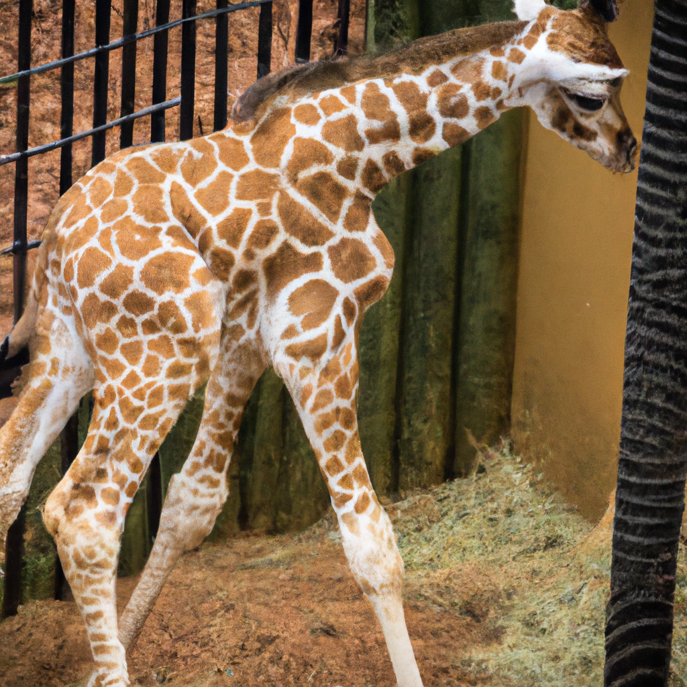

# Greenville Zoo's Female Masai Giraffe Gives Birth to a Baby Calf
*Autumn the giraffe successfully raised five calves before giving birth to her baby calf on Sunday.*
 
The Greenville Zoo's female Masai giraffe, Autumn, has given birth to a baby calf on Sunday. Autumn has successfully raised five calves before giving birth to her baby calf. Both Autumn and her partner Miles are part of the Species Survival Program, which aims to ensure the long-term viability of threatened and endangered species.

## AI predict: Autumn's baby calf is a significant achievement for the Greenville Zoo's Species Survival Program
The Greenville Zoo's Species Survival Program will continue to thrive, and the number of endangered animals will increase, thanks to the successful birth of Autumn's baby calf. Greenville Zoo will receive more funding from the government to increase their efforts in protecting and preserving endangered species. In the near future, we will see an increase in the population of endangered species, and this will be a significant achievement for the Greenville Zoo and the Species Survival Program. 

['GreenvilleZoo', 'SpeciesSurvivalProgram', 'EndangeredSpecies', 'MasaiGiraffe', 'BabyCalf', 'AnimalConservation']