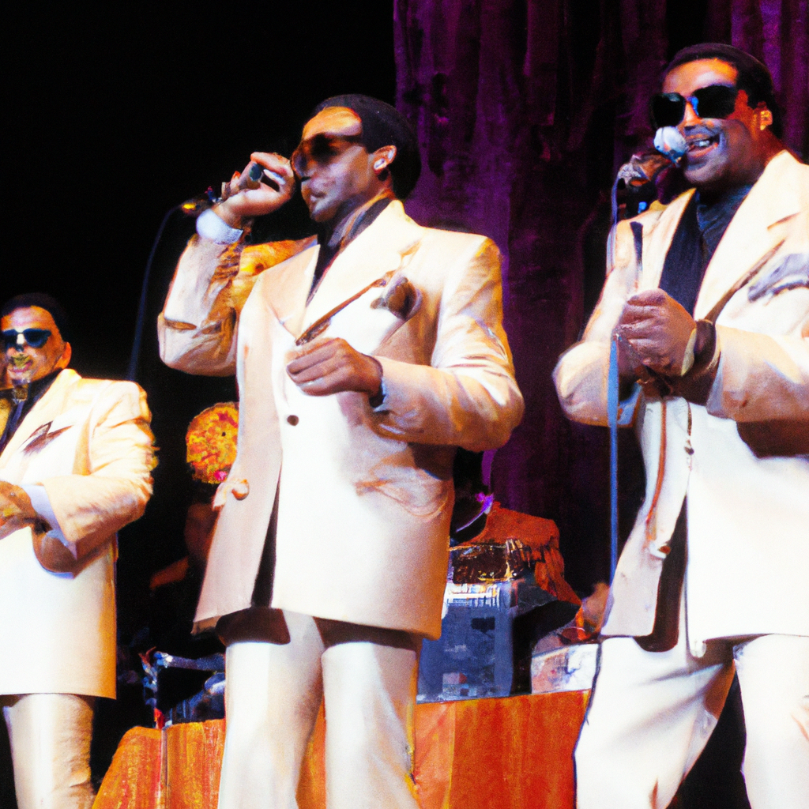

# Isley Brothers' Brother Accuses Younger Sibling Of Trademarking Without Consent
*Rudolph Isley sues Ronald Isley over the rights to 'The Isley Brothers' trademark*
 
Rudolph Isley claims that his brother Ronald Isley has trademarked 'The Isley Brothers' without his consent and is taking all the profits. Rudolph says that they are supposed to split all profits from the band 50/50, but Ronald recently went rogue. Ronald applied for and was granted the exclusive rights to 'The Isley Brothers' for use on 'visual recordings and audiovisual recordings featuring music and animation' back in August, but Rudolph says Ronald needs his approval to cut such a deal. Rudolph wants the court to declare that the trademark is jointly owned by him and his brother and wants Ronald to cough up half of any money he's been making off their band's good name since getting the trademark.

## AI predict: Future of Isley Brothers' trademark ownership and profits uncertain
This dispute between Rudolph and Ronald Isley over 'The Isley Brothers' trademark may continue to escalate as both parties seem to have a strong case to claim ownership. The court's decision will determine the future of the band's name and profits. It is possible that both brothers may reach a settlement, but if not, the legal battle could become costly and tarnish the band's legacy.

['TheIsleyBrothers', 'TrademarkDispute', 'MusicIndustry', 'LegalBattle']