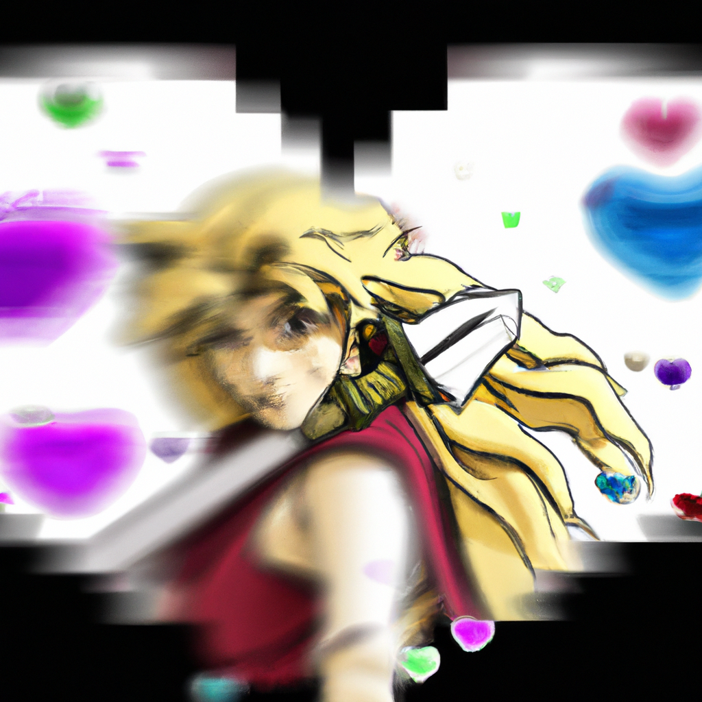

# Marisa's Heart Effects: A Cute Touch in Street Fighter 6
*Marisa adds a little heart effect to her attacks in Street Fighter 6. *
 
Marisa is known for her heavy-hitting blows in Street Fighter 6, but her recent footage reveals her cute side. She adds heart effects to some of her attacks, which can be seen in her Critical Art and charged Gladius punch. Capcom is adding small details to the characters to give them more personality and flair. Marisa's heart effect may have been a recent addition as it was not present in her initial match footage. Street Fighter 6 is launching on June 2, 2023, for PlayStation 4, PlayStation 5, Xbox Series X|S, and PC.

## Capcom May Add Similar Effects to Other Characters' Attacks
Marisa's heart effects have garnered attention from the fans. AI predicts that Capcom may add similar effects to other characters' attacks to increase the game's appeal. The new addition is expected to make the game more popular, leading to increased sales and more tournaments. 

['StreetFighter6', 'SF6', 'Marisa', 'Capcom']