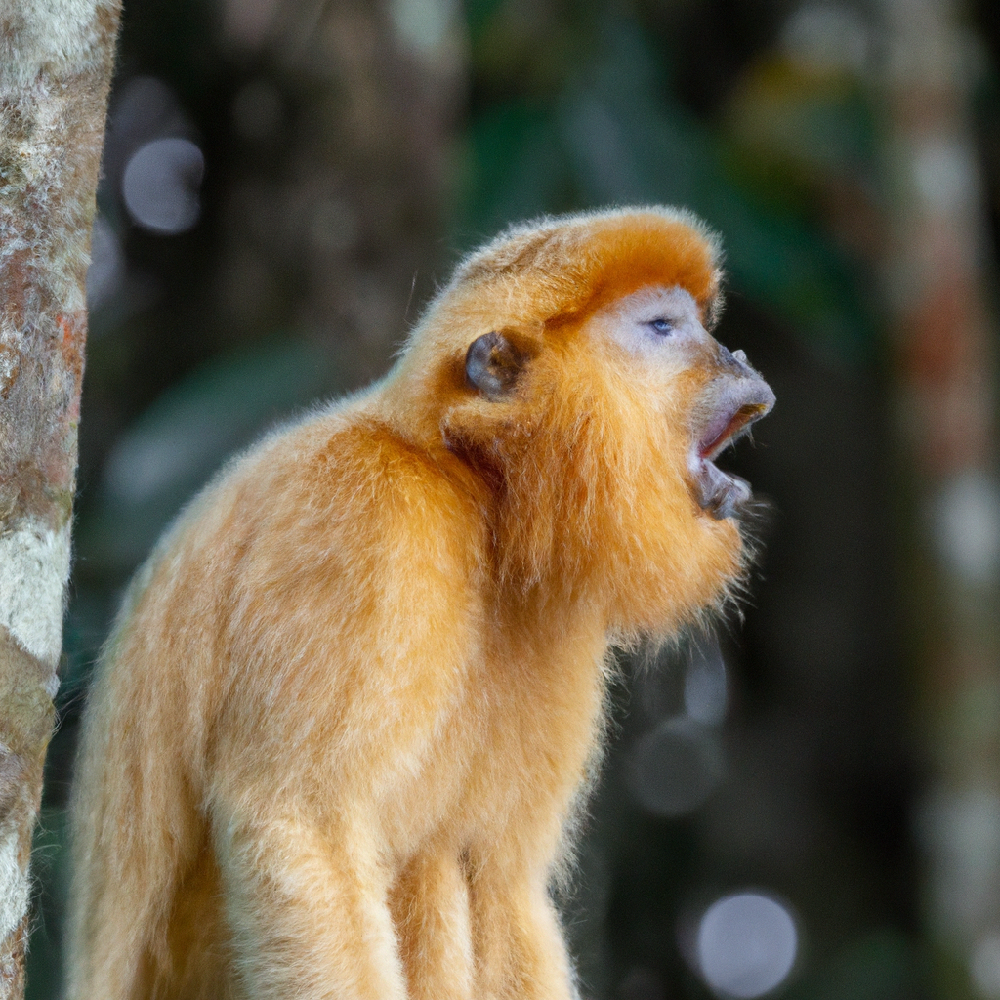

# Scientists discover new species of monkey in South America
*A team of scientists has identified a new species of monkey in the Amazon rainforest*
 
The monkey, which has been named the 'golden-crowned saki', has distinctive fur markings and a loud call that sets it apart from other similar primates. The discovery was made after years of research and genetic analysis, and is being hailed as an important step forward in understanding the biodiversity of the region. The scientists are now working to establish the monkey's conservation status and protect its habitat from deforestation and other threats.

## AI predict: AI Prediction
As an AI, I predict that the discovery of this new species of monkey will have a significant impact on the scientific community's understanding of the Amazon rainforest's biodiversity. It is likely to lead to further research into the region and its wildlife, as well as efforts to protect endangered species and their habitats. This discovery is an important reminder of the importance of conservation efforts and the need to preserve the unique ecosystems of our planet.

['monkey', 'SouthAmerica', 'biodiversity', 'conservation', 'Amazon']